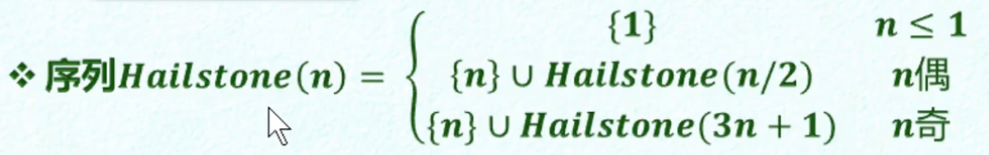

#### 历史背景

The term "Algorithms" goes back to Al Khwarizmi, who lives in Bacydud in the 9th century,

* wrote a book (in Arabic) on decimal number and how to 
  * add, subtract, multiply, divide
  * computer &radic;x
  * compute digits of π
* In short: the first book on algorithms.
  * Before that, it was all Roman Numerals. 

#### Algorithm 定义

* In mathematics and computer science an **algorithm**  is a finite sequence of well-defined, computer-implementable instructions, typically to solve a class of problems or to perform a computation.
*  Algorithms are always unambiguous and are used as specifications for performing calculations, data processing, automated reasoning, and other tasks.(算法始终是明确的，并被用作执行计算，数据处理，自动推理和其他任务的规范。)
* 计算 = 信息处理
* 算法 - 借助某种工具，遵照一定规则，以明确而机械的形式进行
* 计算模型 = 计算机 = 信息处理工具
* 所谓算法，即特定计算模型下，旨在解决特定问题的指令序列
  * 输入 - 待处理的信息（问题）
  * 输出 - 经处理的信息（答案）
  * 正确性 - 的确可以解决指定的问题
  * 确定性 - 任一算法都可以描述为一个由基本操作组成的序列
  * 可行性 - 每一基本操作都可以数显，且在常数时间内完成
  * 有穷性 - 对于任何输入，经有穷次基本操作，都可以得到输出

#### 注意

Any algorithm implies 3 questions: 

1. Is it correct?
2. How much time does it take as a function of input size n?
3. Can we do better? 

Often, space is an important consideration, too.

### 有穷性

以Hailstone序列为例

Hailstone序列不是单调的，一会升一会降，像冰雹一样，也叫冰雹序列，到现在为止还未证明出该序列是否为有穷的。

* 事实：程序 ≠ 算法
  * 死循环or栈溢出

### 什么算法才算好算法

##### 正确

* 符合语法，能够编译、链接
* 能够正确处理**简单的**输入
* 能够正确处理**大规模的**输入
* 能够正确处理**一般性的**输入
* 能够正确处理**退化的**输入
* 能够正确处理**任意合法的**输入

##### 健壮

* 能辨别不合法的输入并做适当处理，而不致非正常退出。

##### 可读

* 结构化 + 准确命名 + 注释 + ...

#### 效率（最重要的）

* 速度尽可能块；存储空间尽可能少
* Algorithms + Data Structures = Programs
* (Algorithms + Data Structures) x Efficiency = Computation