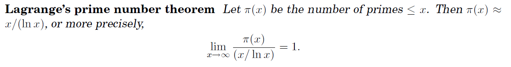

# Generating Random Primes

### Lagrange's prime number theorem



```pseudocode
// 自己写的
function genPrime(N)
Input: a random n-bit number N. 
Output: N / null

Run a primality test on N. 
If it passes the test: 
	return N
else: repeat the process
```

##### Running time

If the randomly chosen $N$ is truly prime, which happens with probability at least $1/n$, then it will certainly pass the test. So on each iteration, this procedure has at least a $1/n$ chance of halting. Therefore on average it will halt within $O(n)$ rounds.

