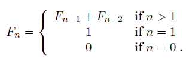
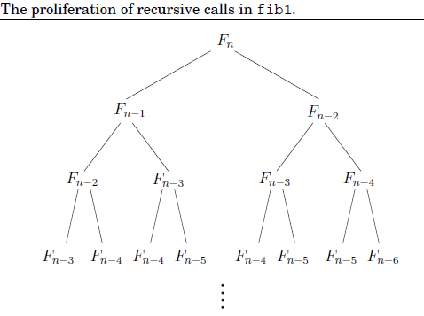

# Fibonacci Numbers

#### 历史背景

* Fibonacci (13th century, Italy) further popularized the decimal system. 
* He is now known mostly for his famous sequences. 
* Fibonacci numbers: 0, 1, 1, 2, 3, 5, 8, 13, 21, ...
  * Rabbit growth and Fibonacci (based on a single model for rabbit growth without death.)
  * Each number is the sum of its 2 immediate predecessors. 

#### 定义



* Fibonacci number grow very fast, almost as fast as 2<sup>n</sup>.
* F<sub>100</sub> is 21 digits long.
* In general, F<sub>n</sub> = 2<sup>0.694n</sup>
* We need an algorithm for the precise value of F<sub>100</sub> or F<sub>200</sub>

#### Algorithm

Any algorithm implies 3 questions: 

1. Is it correct?
2. How much time does it take as a function of input size n?
3. Can we do better? 

Often, space is an important consideration, too.

```pseudocode
// An exponential algorithm (pseudo-code)

function fib1(n)
	if n=0: return 0
	if n=1: return 1
	return fib1(n-1) + fib1(n-2)
```

* 上述代码分析：

  1. Is it correct?

     Yes, by definition。

  2. How much time does it take as a function of input size n?

     * Let T(n) be the number of steps needed to compute fib1(n).
         - T(n)≤2 for n≤1.
         - T(n)=T(n-1)+T(n-2)+3 for n>1
     * Observation: T(n)≥F(n)
       * Running time grows as fast as the Fibonacci numbers!
       * T(n) is exponential in n, so very impractical (except for very small n).
     * Q: How bad is this in practice? Could we compute F(200)?
       * T(200)≥F(200)≥2<sup>138</sup> elementary computing steps. 
       * With 40 trillian operations per second (NEC Earth simulator), fib1(200) takes about 2<sup>92</sup> seconds. Even longer than the remaining life of our sun. 
       * Even <u>Moore's law</u> does not help. (Moore's law: Computers get 1.6 times faster every year or twice as fast every 18 months).
       * fib1(n) takes roughly 2<sup>0.694n</sup> ≈ 1.6<sup>n</sup> steps. 
       * it takes 1.6 times longer to compute F<sub>n+1</sub> than F<sub>n</sub>
       * If we can compute F(100) with this year's technology, then we can compute F(101) with next year's technology. 
       * Just one more Fibonacci number per year!
       * Our algorithm is hopelessly insufficient - we need to do better. 

     * Why is fib1(n) so slow?

       

       * The above recursion tree shows the way recursive invocations trigger by a call to fib1(n) (上面的递归树显示了通过调用fib1（n）触发递归调用的方式) - and repeated calls. 
       * More sensible approach: solve intermediate results. (A form of dynamic programming).

```pseudocode
// A polynomial algorithm

function fib2(n)
	if n=0: return 0
	array f[0, ..., n]
	f[0]=0, f[1]=1
	for 1=2 to n:
		f[i]=f[i+1]+f[i+2]
	return f[n]
```

* 上述代码分析：
  1. Is it correct?
     * Yes, by definition. 
  2. How much time does it take as a function of input size n?
     * Time: inner loop get executed n-1 times (one addition)
     * fib2(n) is linear in n.
     * We are now down from exponential to linear time. 
     * 弊端： 内存运用not efficient. (没有哪种语言能表示出这么大的数字)
  3. Can we do better? 

* Now, F<sub>200</sub> or even F<sub>200000</sub> can be reasonably computed, but ...
* One outstanding issue: 
  * It is reasonable to treat addition as a single computer step if small numbers are being added, 32-bit numbers say. 
  * But the $nth$ Fibonacci number is about 0.694 bits long, and this can far exceed 32 as n grows. 
  * Arithmetic operations on arbitrarily large numbers cannot possibly be performed in a single, constant-time step. 
  * The addition of two n-bit numbers takes time roughly proportional to n. Thus fib1, which performs about F<sub>n</sub> additions, actually uses a number of basic steps roughly proportional to nF<sub>n</sub>. 
  * fib2(n) has to add increasingly large integers. 
  * issues around precision on time (if software package for large integers is used).
  * it takes more time to add F<sub>199</sub> and F<sub>200</sub> than F<sub>3</sub> and F<sub>4</sub> → fib1(n) roughly performed F<sub>n</sub> additions. 
  * fib2(n) → number of basic steps is roughly proportional to n<sup>2</sup> (still polynomial)


