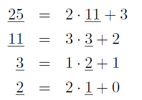
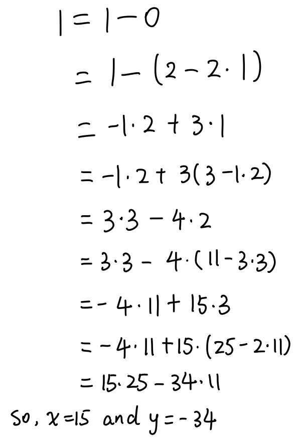

# Modular Arithmetic

**Modular arithmetic** is a system for dealing with restricted ranges of integers. We define $x$ $modulo$ $N$ to be the remainder when $x$ is divided by $N$; that is, if $x=qN+r$ with $0≤r<N$, then $x$ modulo $N$ is equal to $r$.

This gives an enhanced notion of equivalence between numbers: $x$ and $y$ are congruent modulo $N$ if they differ by a multiple of $N$, or in symbols, $x\equiv y(mod N) \iff N$ divides $(x-y)$ 

One way to think of modular arithmetic is that it limits numbers to a predefined range ${0, 1, ...,N-1}$ and wrap around whenever you try to leave this range. 

Another interpretation is that modular arithmetic deals with all the integers, but divides them into $N$ equivalence classes, each of the form $\{i+kN:k\in \Z\}$ for some $i$ between $0$ and $N-1$. 

### Substitution rule

If $x\equiv x' (mod N)$ and $y\equiv y' (mod N)$, then: 

​	$x+y\equiv x'+y' (mod N)$ and 

​	$xy\equiv x'y' (mod N)$		

**Associativity**: $x + (y + z) \equiv (x + y) + z (mod N)$ 
**Commutativity**: $xy \equiv yx (mod N)$ 
**Distributivity**: $x(y + z) \equiv xy + yz (mod N)$ 


Example:  $2^{345} \equiv (2^5)^{69} \equiv 32^{69} \equiv 1^{69} \equiv 1 (mod 31)$

解题思路： 345可以分成5和69相乘，$2^5 = 32$恰好和$31$相差1


### Two's complement 补码

补码表示范围： $[-2^{n-1}, 2^{n-1}-1]$

​	正数 $x$：$x\in[0, 2^{n-1}-1]$, 常规二进制表示法，最前面是0

​	负数 $-x$：$x\in[1,2^{n-1}]$, 先用常规二进制表示，然后0/1反转，最后+1

用Modular的思想：

​	任意在 $[-2^{n-1}, 2^{n-1}-1]$范围内的数，都是保存在 $(mod 2^n)$中。

​	负数$(-x)$就可以写成 $2^n-x$.

​	这样表示，加减乘除都可以直接做，不需要担心溢出。


### Modular addition and multiplication 

$x\equiv y (mod N)$

* **Addition** 
  * Its running time is linear in the sized of these numbers, in other words O(n), where $n=\lceil logN \rceil$ is the size of N; (we always use $n$ to denote input size)
* **Multiplication**
  * Start with regular multiplication and then reduce the answer modulo N. The product can be as large as $(N-1)^2$, but this is still at most $2n$ bits long since $log(N-1)^2=2log(N-1)≤2n$.
  * To reduce the answer modulo $N$, we compute the remainder upon dividing it by $N$, using our quadratic-time division algorithm. 
  * Multiplication thus remains a quadratic operation. 
* **Division**
  * In ordinary arithmetic, there is just one tricky case - division by zero. 
  * It turns out that in modular arithmetic there are potentially other such cases as well. 
  * Whenever division is legal, it can be managed in cubic time, $O(n^3)$.

### Modular Exponentiation

```pseudocode
function modexp(x,y,N)
Input: Two n-bit integers x and N, an integer exponent y
Output: x^y mod N

if y=0: return 1
z = modexp(x, ⌊y/2⌋, N)
if y is even: 
	return z^2 mod N
else: 
	return x·z^2 mod N
```

* 
* To make sure the numbers we are dealing with never grow too large, we need to perform all intermediate computations modulo $N$. The resulting sequence of intermediate products, ($x$ mod $N$) → ($x^2$ mod $N$) → ($x^3$ mod $N$) → ... →($x^y$ mod $N$), consists of numbers that are smaller than N, and so the individual multiplications do not take too long. 
* If starting with $x$ and squaring repeatedly modulo $N$, we get ($x$ mod $N$) → ($x^2$ mod $N$) → ($x^4$ mod $N$) → ... → ($x^{2\lfloor log y \rfloor}$ mod $N$). Each takes just $O(log^2N)$ time to compute, and in this case there are only $log y$ multiplications. 
  * To determine $x^y$ mod $N$, we simply multiply together an appropriate subset of these powers, those corresponding to 1's in the binary representation of $y$. 
  * ex: $x^{25}$ = $x^{11001_2}$ = $x^{10000_2}$·$x^{1000_2}$·$x^{1_2}$
  * A polynomial-time algorithm is finally within reach. 
* Let $n$ be the size in bits of $x$, $y$, and $N$ (whichever is largest of the three). As with multiplication, the algorithm will halt(停止) after at most $n$ recursive calls, and during each call it multiplies $n-bit$ numbers (doing computation modulo $N$ saves us here), for a total running time of $O(n^3)$.

### Euclid's algorithm for greatest common divisor 求最大公约数

```pseudocode
function Euclid(a,b)
Input: Two integers a and b with a≥b≥0
Output: gcd(a,b)

if b=0: return a
return Euclid(b, a mod b)
```

 (求最大公约数的第一反应：factor $a$, $b$, 然后把两个数的所有公因数的乘积就是最大公约数，但是目前为止还没有能高效factor的算法)

##### **Euclid's rule** 

If $x$ and $y$ are positive integers with $x≥y$, then $gcd(x,y)=gcd(x mod y, y)$.

*Proof.* 

It is enough to show the slightly simpler rule $gcd(x,y)=gcd(x-y,y)$ from which the one stated can be derived by repeatedly subtracting $y$ from $x$.

Any integer that divides both $x$ and $y$ must also divide $x-y$, so $gcd(x,y)≤gcd(x-y, y)$.

Likewise, any integer that divides both $x-y$ and $y$ must also divide both $x$ and $y$, so $gcd(x,y)≥gcd(x-y,y)$. 

##### Lemma

If $a>b$, then $a$ mod $b$ < $a/2$.

*Proof.*

Witness that either $b≤a/2$ or $b>a/2$. 

If $b≤a/2$, then we have $a$ mod $b$ $< b ≤ a/2$;

If $b>a/2$, then $a$ mod $b$ = $a-b < a/2$.


* This means that after any two consecutive rounds, both arguments, $a$ and $b$, are at the very least halved in value - the length of each of each decreases by at least one bit. If they are initially n-bit integers, then the base case will be reached within $2n$ recursive calls. And since each call involves a quadratic-time division, the total time is $O(n^3)$.


### An Extension of Euclid Algorithm (求倒数 multiplicative inverse) 辗转相除法

```pseudocode
function extended-Euclid(a,b)
Input: Two positive integers a and b with a≥b≥0
Output: Integers x,y,d such that d=gcd(a,b) and ax+by=d

if b=0: return (1,0,a)
(x',y',d)=Extended-Euclid(b,a mod b)
return (y',x'-⌊a/b⌋y',d)
```

##### Lemma

**If $d$ divides both $a$ and $b$, and $d=ax+by$ for some integers $x$ and $y$, then necessarily $d=gcd(a,b)$.**

*Proof.*

By the first two conditions, $d$ is a common divisor of $a$ and $b$ and so it cannot exceed the greatest common divisor; that is, $d≤gcd(a,b)$. 

On the other hand, since $gcd(a,b)$ is a common divisor of $a$ and $b$, it must also divide $ax+by=d$, which implies $gcd(a,b)≤d$. 

Putting these together, $d=gcd(a,b)$.

##### Lemma

**For any positive integers $a$ and $b$, the extended Euclid algorithm returns integers $x$, $y$, and $d$ such that $gcd(a,b)=d=ax+by$.**

*Proof.*

The first thing to confirm is that if you ignore the $x$'s and $y$'s, the extended algorithm is exactly the same as the original. So, at least we compute $d=gcd(a,b)$.

For the rest, the recursive nature of the algorithm suggests a proof by induction. The recursion ends when $b=0$, so it is convenient to do induction on the value of $b$. 

The base case $b=0$ is easy enough to check directly. Now pick any larger value of $b$. The algorithm finds $gcd(a,b)$ by calling $gcd(b,a mod b)$. Since $a$ mod $b<b$, we can apply the inductive hypothesis to this recursive call and conclude that the $x'$ and $y'$ it returns are correct:  $gcd(b,a mod b) = bx' + (a mod b)y'$.

Writing ($a$ mod $b$) as ($a-\lfloor a/b \rfloor b$), we find $d=gcd(a,b)=gcd(b,a mod b)=bx'+(a mod b)y'=bx'+(a-\lfloor a/b \rfloor b)y'=ay'+b(x'-\lfloor a/b \rfloor y')$.

Therefore $d=ax+by$ with $x=y'$ and $y=x'-\lfloor a/b \rfloor y'$, thus validating the algorithm's behavior on input $(a,b)$.

Ex. $gcd(25,11)$

​	

(at each stage, the gcd computation has been reduced to the underlined numbers). 

Thus $gcd(25,11)=gcd(11,3)=gcd(3,2)=gcd(2,1)=gcd(1,0)=1$.

To find $x$ and $y$ such that $25x+11y=1$, we start by expressing 1 in terms of the last pair $(1,0)$. Then we work backwards:

​	

### Modular division

In real arithmetic, every number $a≠0$ has an inverse $1/a$, and dividing by $a$ is the same as multiplying by this inverse. 

In modular arithmetic, $x$ is the multiplicative inverse of $a$ modulo $N$ if $ax \equiv 1（mod N)$. 

* There can be at most one such $x$ modulo $N$, and we shall denote it by $a^{-1}$.
* this inverse does not always exist. eg. 2 is not invertible modulo 6, since $a$ and $N$ are both even and thus then $a$ mod $N$ is always even. 
* The only circumstance in which $a$ is not invertible: if $gcd(a,N)>1$, then $ax \equiv 1$ mod $N$. 

When $gcd(a, N) \equiv 1$, we say $a$ and $N$ are **relatively prime**. 

##### Modular division theorem

For any $a$ and $N$, a has a multiplicative inverse modulo $N$ if and only if it is relatively prime to $N$. When this inverse exists, it can be found in time $O(n^3)$ (where as usual $n$ denotes the number of bits of $N$) by running the extended Euclid algorithm. 


