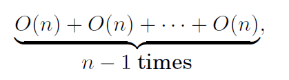
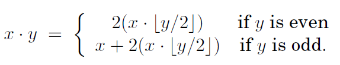

# Multiplication and Division Algorithms

## Multiplication: method 1


* In binary, multiplicative is easy since each intermediate row is either zero or $x$ itself left-shifted an appropriate amount of times. 
  * left-shifting is a quick way to multiply by the base. 
  * right-shifting is to divide by the base, rounding down if needed. 

### Pseudocode

```pseudocode
function multiply(x,y)
Input: Two n-bit integers x and y, where y>0
Output:Their product

if y=0: return 0
z=multiply(x, ⌊y/2⌋)
if y is even:
	return 2z  // even → left-shift 1 bit
else:
	return x+2z   // odd → left-shitf 1 bit +x
```

### Analyzing

* Is this algorithm correct? 

  * The preceding recursive rule is transparently correct.

* How long does the algorithm take?
  * If $x$ and $y$ are both $n$ bits, then there are $n$ intermediate rows, with lengths of up to $2n$ bits (taking the shifting into account). The total time taken to add up these rows, doing two numbers at a time is $O(n^2)$

  (quadratic in the size of the inputs: still polynomial but much slower than addition.)

* Can we do better?

  * Intuitively, it seems that multiplication requires adding about $n$ multiples of one of the inputs, and we know that each addition is linear, so it would appear that $n^2$ bit operations are inevitable. 

## Multiplication: method 2 (Al Khwarizmi's method)


* To multiply two decimal numbers $x$ and $y$, write them next to each other. 
* Then repeat the following: 
  * divide the 1st number by 2, rounding down the result (that is, dropping the .5 if the number was odd), and double the second number. 
  * Keep going till the first number gets down to 1. 
* Then strike out all the rows in which the first number is even, and add up whatever remains in the second column. 

(Compare the 2 algorithms, <u>binary multiplication</u> and <u>multiplication by repeated halvings of the multiplier</u>, notice that they are doing the same thing!)



## Division

### pseudocode

```pseudocode
function divide(x,y)
Input: Two n-bit integers x and y, where y≥1
Output: The quotient and remainder of x divided by y

if x=0: return (q,r)=(0,0)
(q,r)=divide(⌊x/2⌋,y)
if x is odd: r=r+1
if r≥y: r=r-y, q=q+1
return (q,r)
```

### Analyzing

* Is the algorithm correct?
  * The preceding recursive rule is transparently correct.
  * Checking the correctness of the algorithm is merely a matter of verifying that it mimics the rule and that it handles the base case. 
* How long does the algorithm take?
  * It must terminate after n recursive calls, because at each call y is halved - that is, its number of bits is decreased by one. 
  * Each recursive call requires these operations: 
    * a division by 2 (right shift);
    * a test for odd/even (looking up the last bit);
    * a multiplication by 2 (left shift); 
    * possibly one addition
    * A total of $O(n)$ bit operations. 
  * The total time taken is thus $O(n^2)$. 
* Can we do better? 
  * To divide an integer x by another integer y≠0 means to find a quotient $q$ and a remainder $r$, where $x=yq+r$ and $r<y$. 

