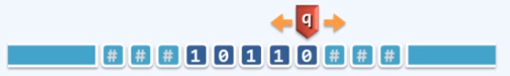
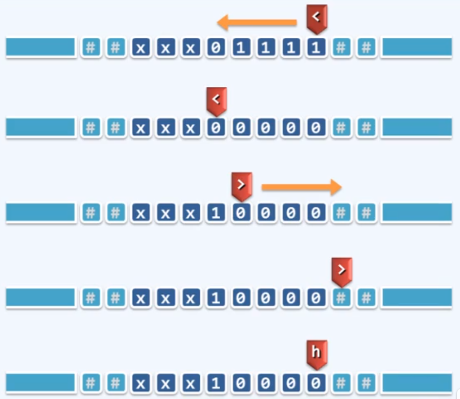

# TM - Turing Machine 图灵机

### 图灵机组成

* Tape - 依次均匀地划分为单元格，各注有某一字符，默认为'#'
* Alphabet - 字符的种类有限
* Head - 也叫“读写头”，总是对准某一单元格，并可读取和改写其中的字符。每经过一个节拍，可转向左侧或右侧的邻格。
* State - 状态，TM总是处于有限种状态中的某一种。每经过一个节拍，可（按照规则）转向另一种状态。
* Transition Function: (q, c; d, L/R, p)
  * 若当前状态为q且当前字符为c，则将当前字符改写为d；
  * 转向左侧L/右侧R的邻格；
  * 转入p状态
  * 一旦转入特定的状态‘h’，则停机



### TM实例：Increase 

##### 功能

将二进制非负整数加一

##### 算法

全'1'的后缀翻转为全'0'，原最低位的'0'或'#'翻转为'1'

##### 实现

```algorithm
(<, 1, 0, L, <) //左行，1->0
(<, 0, 1, R, >) //掉头，0->1
(<, #, 1, R, >) //若是最高位，则会遇到#，也要掉头，此时有溢出
(>, 0, 0, R, >) //右行
(>, #, #, L, h) //复位(因为alg需要有确定的输入，每次复位能保证下次的输入和上次一样)
```




